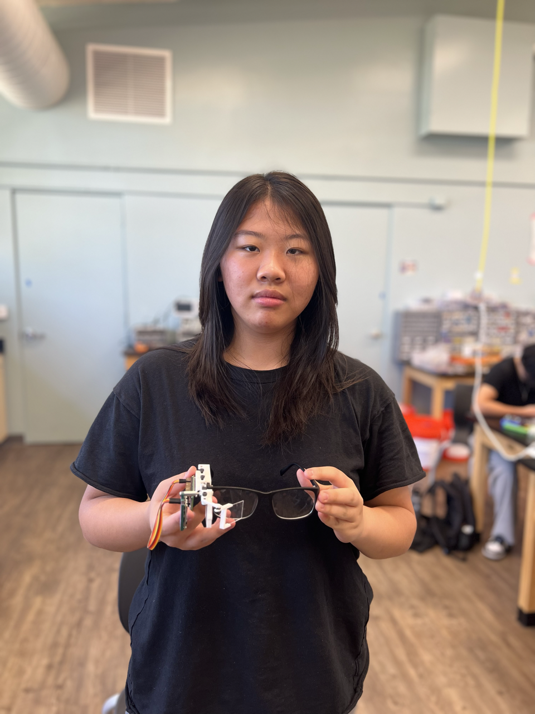
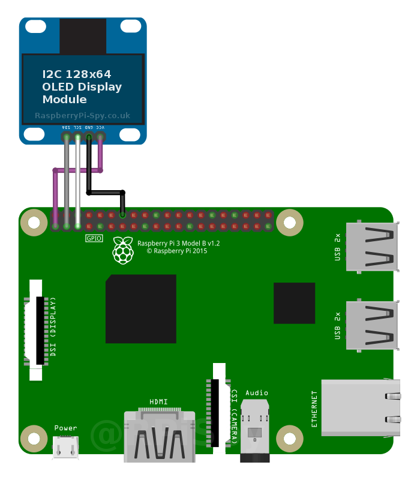

# Smart Glasses
This project is a compact wearable computer, in the form of glasses. It will have a few simple functions such as displaying time, date, or documents, and voice commands using text recognition. It will utilize a Raspberry Pi 0 W for the "brains" of the glasses, since the model has built-in bluetooth and wifi capabilities. It will use a reflection from a .96 inch OLED screen to display information in front of the wearer's eyes. The Pi will control the other components and run all the required code, including the OLED screen, a discreet earpiece, and software function. 


| **Engineer** | **School** | **Area of Interest** | **Grade** |
|:--:|:--:|:--:|:--:|
| Jamie L | Archbishop Mitty | Programming, Mechanical/Electrical Engineering | Sophomore

<!---**Replace the BlueStamp logo below with an image of yourself and your completed project. Follow the guide [here](https://tomcam.github.io/least-github-pages/adding-images-github-pages-site.html) if you need help.**--->

<!------>

  
# Final Milestone

<iframe width="560" height="315" src="https://www.youtube.com/embed/8OlgK4KyGKg" title="YouTube video player" frameborder="0" allow="accelerometer; autoplay; clipboard-write; encrypted-media; gyroscope; picture-in-picture; web-share" allowfullscreen></iframe>

I programmed some basic functions into my glasses at my third milestone. These include a simple boot screen, time function with a clock diagram, and image/file display. Since I usually do not program in Python and therefore had to get introduced to a completely new language, it took me a little to learn the fundamental keywords and their respective syntaxes. Additionally, I had to use many different libraries and modules. I also set up SSH and VNC on my Raspberry Pi so that I could access its screen and terminal on the monitor of my laptop without having to use an external monitor and keyboard/mouse. Howver, the Wifi settings at the school seem to be made so that it blocks the signals, so unfortunately it did not work. 


# Second Milestone

<iframe width="560" height="315" src="https://www.youtube.com/embed/AWz9-APTujE" title="YouTube video player" frameborder="0" allow="accelerometer; autoplay; clipboard-write; encrypted-media; gyroscope; picture-in-picture; web-share" allowfullscreen></iframe>

By the end of the second milestone, I had finished all hardware design and assembly, and enabled the headless setup on my Raspberry Pi. With Onshape, I made the componenets that would attatch the Raspberry Pi, OLED screen, and reflector to an arm that would extend out of the glasses. For the arm, I had to go through three iterations due to faulty printing as well as some design issues, such as durability and arm length. I then assembled the printed parts and adjusted the angle of the reflector so that the user could properly see the image. My next goal would be to program the glasses for its functions.


# First Milestone

<iframe width="560" height="315" src="https://www.youtube.com/embed/QWJzpe3_Zj4" title="YouTube video player" frameborder="0" allow="accelerometer; autoplay; clipboard-write; encrypted-media; gyroscope; picture-in-picture; web-share" allowfullscreen></iframe>

For my first milestone, I set up a desktop environment on my Raspberry Pi, and soldered all of my componenets and ensured that they work properly. I had a lot of trouble with the initial transparent screen that I was using for the display, and I eventually had to switch to an alternative design, which used a smaller screen and its reflection to show the user information. I also had to transition from a SPI connection to I2C. In my future milestones, I will CAD and 3D-print a casing for the Pi to rest in next to the glasses, then get started with the code. I have only basic skills on CAD and programming, so those would be my next main challenges.


# Starter Project

<iframe width="560" height="315" src="https://www.youtube.com/embed/zXdnlKfFbyw" title="YouTube video player" frameborder="0" allow="accelerometer; autoplay; clipboard-write; encrypted-media; gyroscope; picture-in-picture; web-share" allowfullscreen></iframe>

Links: <a href = "https://www.makershed.com/products/the-useless-machine-kit-soldering"> Product page, </a> <a href = "http://www.spikenzielabs.com/Downloadables/uselessmachine/Useless-Machine-Soldering-Edition.pdf"> Instructions </a> <br>
I chose the 006 Useless Box as my starter project since it involved multiple aspects of engineering; it required soldering, motor control, and physical assembly. A useless box is, as demonstrated above, a device that turns itself off when activated. When the lever on the box is flipped, the servo with an arm attatched is powered, coming up to the top of the box and flipping the lever so that the servo turns the other way instead. When it goes back to its original position inside the box, it hits a switch that turns itself off. 

# Schematics 



This is a Raspberry Pi 3B, while my Pi was a Zero W. They, however, do share the same pinouts. This wiring is the one I used for my screen. 


# Code

```python
from bs4 import BeautifulSoup as soup
from urllib.request import urlopen
import os
from luma.core.interface.serial import i2c
from luma.core.render import canvas
from luma.oled.device import ssd1306
import time
import datetime
import wolframalpha
# import speech_recognition as sr
# import pyaudio
import wikipedia

# WOLFRAM
app_id = ''
# Put your app id here (You can sign up for one at the Wolfram Alpha website.)

client = wolframalpha.Client(app_id)
res = client.query('What is the temperature in ______')
# Put any place here.
answer = next(res.results).text
str1 = answer
str2 = str1.split('(', 1)[0]

bad_chars = [';', '|', '(', ')', '+', '=', '1']

num = ["05", "10", "15", "20", "25", "30", "35", "40", "45", "50", "55", "0"]

def dateTime():
  cdt = datetime.datetime.now()
  min1 = str(cdt.minute)
  hour = str(cdt.hour)

  with canvas(device) as draw:
    draw.text((0, 0), hour, fill = "blue")
    draw.text((11, 0),":", fill = "blue")
    draw.text((15, 0), min1, fill = "blue")
    draw.text((0, 0), "___________", fill = "yellow")
    draw.text((33, 0), str2, fill = "white")
    draw.text((0, 115), "...", fill = "white")
def listen():
  print('listening...')
  time.sleep(5)
  dateTime()
  global val
  val = input()
  #os.system('arecord -d 4 -f cd -t wav -D bluealsa:DEV=00:00:00:00:00:00,PROFILE=sco test.wav') #Replace the MAC address with that of your hedset


def say(statement):
  statement1 = statement.replace(" ", "_")
  os.system('espeak ' + str(statement1) + ' -ven+f3 -k5 -s130 --stdout | aplay -D bluealsa:DEV=00:00:00:00:00:00,PROFILE=sco') #Change the MAC address here as well

def query(query):
  client = wolframalpha.Client(app_id)
  res = client.query(query)
  answer = next(res.results).text
  answer1 = answer.partition('\n')[0]
  print(answer1)

def start_up():
  hour1 = int(datetime.datetime.now().hour)
  if hour1 >= 0 and hour1 < 12:
      print('Good morning.')
      #say('good morning')
  elif hour1 >= 12 and hour1 < 20:
      print('Good afternoon.')
      #say('good afternoon')
  else:
      print('Good evening.')
      #say('good evening')
  print('How may I help you?')
  # say('how may i help you)

serial = i2c(port=1, address=0x3C)
# Put in the address of your display instead of 0x3C, it may be 0x3C.
device = ssd1306(serial, rotate=0)

text = ("What would you like to say? ")
text1 = ('\n'.join([text[i:i+11] for i in range(0, len(text), 11)]))

cdt = datetime.datetime.now()

start_up()

def utilitys():
  cdt = datetime.datetime.now()
  min1 = str(cdt.minute)
  hour = str(cdt.hour)

  with canvas(device) as draw:
    draw.text((0, 0), hour, fill = "blue")
    draw.text((11, 0),":", fill = "blue")
    draw.text((15, 0), min1, fill = "blue")
    draw.text((0, 0), "___________", fill = "yellow")
    draw.text((33, 0), str2, fill = "white")
    if min1 in num:
      client = wolframalpha.Client(app_id)
      res = client.query('What is the temperature in San Fransisco')
      answer = next(res.results).text
      str1 = answer
      str3 = str1.split('(', 1)[0]
      draw.text((33, 0), str3, fill = "white")

def util(func1):
  cdt = datetime.datetime.now()
  min1 = str(cdt.minute)
  hour = str(cdt.hour)

  with canvas(device) as draw:
    draw.text((0, 0), hour, fill = "blue")
    draw.text((11, 0),":", fill = "blue")
    draw.text((15, 0), min1, fill = "blue")
    draw.text((0, 0), "___________", fill = "yellow")
    #draw.text((0, 9), date, fill = "white")
    draw.text((33, 0), str2, fill = "white")
    draw.text((0, 64), func1, fill = "white")

while True:
  utilitys()
  listen()
  try:
    if len(val) >= 2:
      if 'news' in val:
        news_url="https://news.google.com/news/rss"
        Client=urlopen(news_url)
        xml_page=Client.read()
        Client.close()
        soup_page=soup(xml_page,"xml")
        news_list=soup_page.findAll("item")
        i = 0
        util('news...')
        for news in news_list:
          print(news.title.text + "\n")
          print(news.link.text)
          i += 1
          time.sleep(1)
          if i == 3:
            break
        del val
        util("news...")
        time.sleep(3)

      if 'exit program' in val:
        os.system('pkill -f edited.py')
        del val

      if 'time' in val:
        cdt1 = datetime.datetime.now()
        h = cdt1.hour
        m = cdt1.minute
        print(str(h) + ':' + str(m))
        say(str(h))
        say(str(m))

        del val
        util("time...")
        time.sleep(3)

      if 'play my music' in val:
        util("music...")
        time.sleep(2)

# Replace the 00:00:00:00:00:00 with the MAC address of your headset
        os.system('aplay -D bluealsa:DEV=00:00:00:00:00:00,PROFILE=sco /home/pi/Desktop/Imagine.wav')
        del val
        say('Would you like me to play the next song')
        listen()
        if 'Yes' in val:
          os.system('aplay -D bluealsa:DEV=00:00:00:00:00:00,PROFILE=sco /home/pi/Desktop/BeautifulName.wav')
          del val
          say('would you like me to play the next song')
          listen()
          if 'Yes' in val:
            os.system('aplay -D bluealsa:DEV=00:00:00:00:00:00,PROFILE=sco /home/pi/Desktop/Oceans.wav')
            del val
        if 'No' in val:
          del val
          continue

      try:
        client1 = wolframalpha.Client(app_id)
        res1 = client1.query(val)
        answer1 = next(res1.results).text
        answer2 = answer1.partition('\n')[0]
        for i in bad_chars:
          answer2 =  answer2.replace(i, '')
        print(answer2)
      except:
        try:
          print(wikipedia.summary(val, sentences = 1))
        except:
          print('')
      del val
  except:
    print(' ')

```
Sadly, the bluealsa library (aplay, arecord) here does not work on Bullseye distribution. I was however succesful in bypassing such restrictions by using Bookworm from instructions here: [https://robotzero.one/raspberry-pi-zero-voice-controller/](url)


# Bill of Materials

| **Part** | **Note** | **Price** | **Link** |
|:--:|:--:|:--:|:--:|
| Raspberry Pi Zero W | Brains of the glasses | $15.00 | <a href="https://www.pishop.us/product/raspberry-pi-zero-w/"> Link </a> |
|:--:|:--:|:--:|:--:|
| Bluetooth Earbuds | Audio information | $11.99 | <a href="https://www.amazon.com/BEBEN-Wireless-Bluetooth-Headphones-Waterproof/dp/B09SFZ7JZ8/"> Link </a> |
|:--:|:--:|:--:|:--:|
| .96in OLED Display | Visual information | $7.29 | <a href="https://www.amazon.com/HiLetgo-Serial-128X64-Display-Color/dp/B06XRCQZRX/ref=asc_df_B06XRBTBTB/?tag=&linkCode=df0&hvadid=312232463708&hvpos=&hvnetw=g&hvrand=18168632221262009846&hvpone=&hvptwo=&hvqmt=&hvdev=c&hvdvcmdl=&hvlocint=&hvlocphy=9032171&hvtargid=pla-563271619351&ref=&adgrpid=57656765450&th=1"> Link </a> |
|:--:|:--:|:--:|:--:|
| Battery Bank | Power Source | $17.99 | <a href="https://www.amazon.com/Anker-PowerCore-Ultra-Compact-High-Speed-Technology/dp/B01CU1EC6Y"> Link </a> |
|:--:|:--:|:--:|:--:|
| Power Supply Cable | RasPi Power | $9.95 | <a href="https://www.amazon.com/CanaKit-Raspberry-Supply-Adapter-Listed/dp/B00MARDJZ4"> Link </a> |
|:--:|:--:|:--:|:--:|
| HDMI Cable (Mini to Full) | RasPi to monitor | $8.79 | <a href="https://www.amazon.com/AmazonBasics-High-Speed-Mini-HDMI-Adapter-Cable/dp/B014I8UEGY/"> Link </a> |
|:--:|:--:|:--:|:--:|
| Micro SD Card | RasPi OS | $5.60 | <a href="hhttps://www.amazon.com/Center-Memory-Adapter-Mobile-Storage/dp/B09MC3MKYS"> Link </a> |
|:--:|:--:|:--:|:--:|
| Keyboard and Mouse | Navigate RasPi on desktop | $15.19 | <a href="https://www.amazon.com/Rii-Ultra-slim-Wireless-Multimedia-Raspberry/dp/B07BF3LFN3"> Link </a> |
|:--:|:--:|:--:|:--:|
| Non-prescription Glasses | Base of project | $10.99 | <a href="https://www.amazon.com/GQUEEN-201512-Fashion-Rectangular-Glasses/dp/B00ZRD1MEI/"> Link </a> |

# Documents Referenced

<a href = "https://www.instructables.com/Smart-Glasses-V2/"> Initial Idea, </a> <a href = "https://www.raspberrypi-spy.co.uk/2018/04/i2c-oled-display-module-with-raspberry-pi/"> Screen Configuration, </a> <a href = "https://www.hackster.io/petewarden/recognizing-speech-with-a-raspberry-pi-50b0e6"> Speech Recognition Library </a>

<!---# Other Resources/Examples
One of the best parts about Github is that you can view how other people set up their own work. Here are some past BSE portfolios that are awesome examples. You can view how they set up their portfolio, and you can view their index.md files to understand how they implemented different portfolio components.
- [Example 1](https://trashytuber.github.io/YimingJiaBlueStamp/)
- [Example 2](https://sviatil0.github.io/Sviatoslav_BSE/)
- [Example 3](https://arneshkumar.github.io/arneshbluestamp/)

To watch the BSE tutorial on how to create a portfolio, click here.--->
